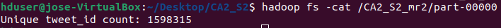
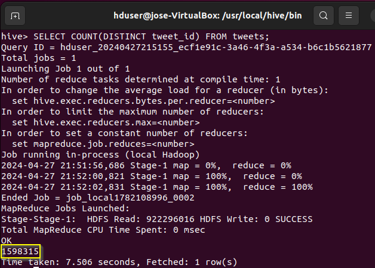
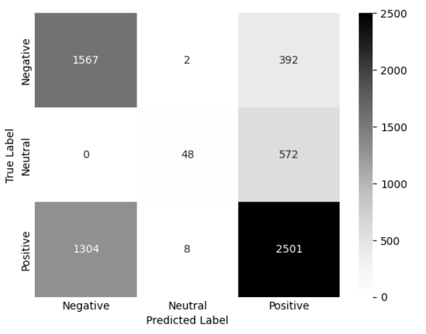
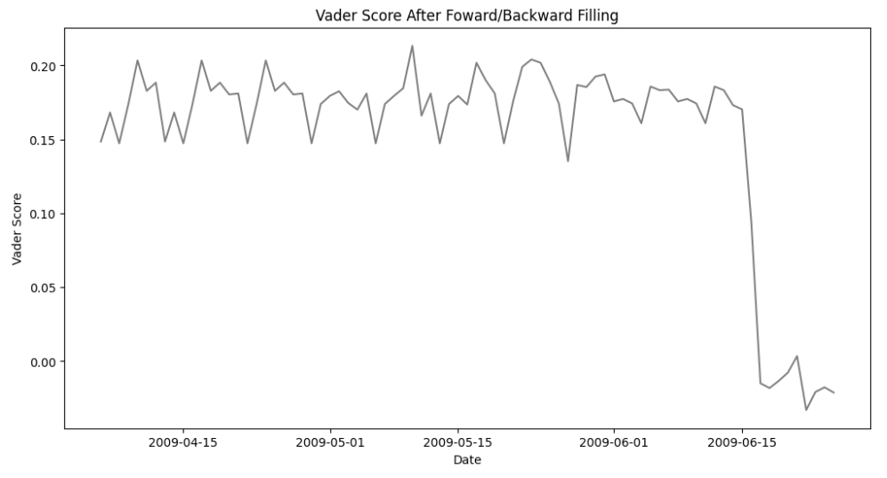
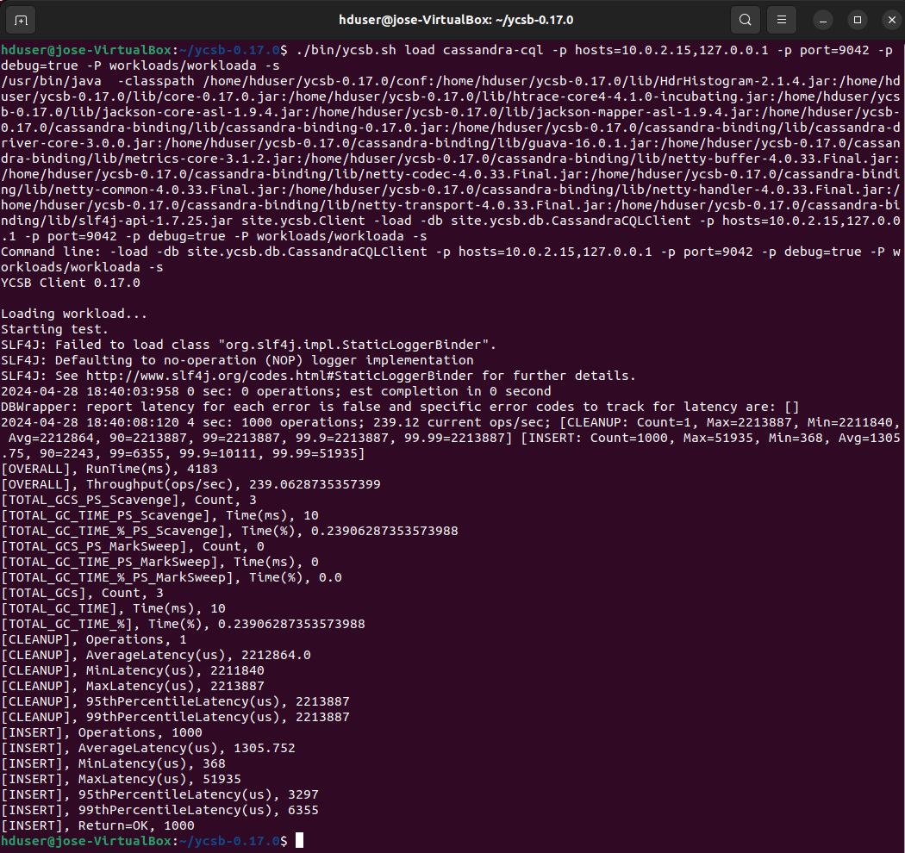

**CCT College Dublin Continuous Assessment**


### Learning Outcomes

Please note this is not the assessment task. The task to be completed is detailed on the next page. This CA will assess student attainment of the following minimum intended learning outcomes:

#### Big Data Storage and Processing MLOs:
- Critically assess the data storage and management requirements of a given data project from a modern perspective and evaluate limitations of legacy approaches to Big Data. (Linked to PLO 3)
- Assess the design concepts and architectural patterns of distributed Big Data systems and analyse the components that form their technology stack. (Linked to PLO 1, PLO 2)
- Critically evaluate and select a Big data environment suitable for retrieving and processing a given Big Data set, perform data management and select appropriate analytic algorithms for the required scale and speed. (Linked to PLO 2, PLO 3)

#### Advanced Data Analytics MLOs:
- Analyse a set of requirements to determine the type of Advanced Data Analysis for a particular problem set. Document and justify choices made to stakeholders and peers through insight gained from the process. (Linked to PLO 4, PLO 5)
- Develop a solution reliant on temporal data (e.g. social media feed, sensor data) to solve a given problem set. (Linked to PLO 1, PLO 2)
- Critically assess the existing state of the art in Natural Language Processing and propose a strategy toward optimisation. (Linked to PLO 1, PLO 2, PLO 4)

### Attainment of Learning Outcomes

Attainment of the learning outcomes is the minimum requirement to achieve a Pass mark (40%). Higher marks are awarded where there is evidence of achievement beyond this in accordance with QQI Assessment and Standards Revised 2013 and summarised in the following table:

| Percentage Range | QQI Description of Attainment                          |
|------------------|-------------------------------------------------------|
| 70% +            | Achievement includes that required for a Pass and in most respects is significantly and consistently beyond this |
| 60 – 69%         | Achievement includes that required for a Pass and in many respects is significantly beyond this  |
| 40 – 59%         | Attains all the minimum intended programme learning outcomes   |
| 35 – 39%         | Nearly (but not quite) attains the relevant minimum intended learning outcomes  |
| 0 – 34%          | Does not attain some or all of the minimum intended learning outcomes  |

The CCT Grade Descriptor describes the standard of work for grade boundaries summarised below. The full descriptor is available on Moodle.  

| Grade          | Performance    |
|----------------|----------------|
| 90-100%        | Exceptional    |
| 80-89%         | Outstanding    |
| 70-79%         | Excellent      |
| 60-69%         | Very Good      |
| 50-59%         | Good           |
| 40-49%         | Acceptable     |
| 35-39%         | Fail           |
| <35%           | Fail           |

#### Acceptable and Unacceptable Use of AI


**Note:** ALL Students are required to use Git for any Assignments that they are working on. This means that ALL changes must be committed to Git during your assignment. (Not just a single commit at the end!) This is to allow you to display your incremental progress throughout the assessments, give you practice for your capstone/thesis, allow you to create an online portfolio that can be used to showcase your work, and to ensure that there are no problems with final uploads (as all your work will be available on GitHub). It is expected that there will be a minimum of 10 commits (with many of you making very many more).

You may only use your CCT email for your git account; private/work email-based accounts will not be accepted. You must also include your lecturer's CCT email as a collaborator on your account.

Students are advised to review and adhere to the submission requirements documented after the assessment task. 
### Assessment Task

Students are advised to review and adhere to the submission requirements documented after the assessment task.

It is required that you use GitHub Classroom as your version control repository with regular commits of code and report versions. You may be called to a Viva to defend your work.

Please find the GitHub Classroom link below:
[GitHub Classroom](https://classroom.github.com/a/WaCGox0Z)

You may not upload a PDF document for your report. It MUST be a Word document. This is not a scientific paper and must be formatted in standard report format.

In this continuous assessment, you are required to identify and carry out an analysis of a large dataset gleaned from the Twitter API available on Moodle as “ProjectTweets.csv”. This data should be stored as requested below and you are then required to analyse any change sentiment that occurs over the time period detailed in the file.

#### Context
This dataset contains 1,600,000 tweets extracted using the Twitter API.

#### Content
It contains the following 5 fields:
- ids: The id of the tweet (e.g., 4587)
- date: The date of the tweet (e.g., Sat May 16 23:58:44 UTC 2009)
- flag: The query (e.g., lyx). If there is no query, then this value is NO_QUERY.
- user: The user that tweeted (e.g., bobthebuilder)
- text: The text of the tweet (e.g., Lyx is cool)

Following your analysis, you are then required to make a time series forecast of the sentiment of the entire dataset at 1 day, 3 days, and 7 days going forward. This forecast must be displayed as a dynamic dashboard.

#### Your project must incorporate the following elements:
- Utilisation of a distributed data processing environment (e.g., Hadoop Map-reduce or Spark) for some part of the analysis.
- Source dataset(s) can be stored into an appropriate SQL/NoSQL database(s) prior to processing by MapReduce/Spark (HBase/HIVE/Spark SQL/Cassandra/MongoDB/etc.) The data can be populated into the NoSQL database using an appropriate tool (Hadoop/Spark/etc.).
- Post Map-reduce processing dataset(s) can be stored into an appropriate NoSQL database(s) (Follow a similar choice as in the previous step).
- Store the data and then follow-up analysis on the output data. It can be extracted from the NoSQL database into another format using an appropriate tool if necessary (e.g., extract to CSV to import into R/Python/etc.).
- Devise and implement a test strategy in order to perform a comparative analysis of the capabilities of any two databases (MySQL, MongoDB, Cassandra, HBase, and CouchDB) in terms of the performance. You should record a set of appropriate metrics and perform a quantitative analysis for comparison purposes between the two chosen database systems.
- Provide evidence and justification of your choice of sentiment extraction techniques.
- Explore at least 2 methods of time-series forecasting including at least 1 Neural Network and 1 autoregressive model (ARIMA, SARIMA, etc.). (Hint: This is a short time series. How are you going to handle this?)
- Evidence and justify your choices for your final analysis and include your forecasts at 1 day, 3 days, and 7 days going forward.
- Your dashboard must be dynamic and interactive. Include your design rationale expressing Tuft’s principles.

#### Deliverables:
The results of the analysis must be presented in the form of a project report. This report should discuss the storage and processing of big data using advanced data analytics techniques. The report should be 3000 ± 10% words in length (excluding references, titles, and code) and must follow the Harvard style format in addition to employing appropriate referencing methods and academic writing style. The report should include the following:

**Big Data**
- Details of the data storage and processing activities carried out including preparation of the data and processing the data in a MapReduce/Spark environment; [0-30]
- Comparative analysis for at least two databases (one SQL and at least one NOSQL) using YCSB. [0-30]
- A discussion of the rationale and justification for the choices you have made in terms of data processing and storage programming language choice that you have implemented. [0-20]
- Design the architecture for the processing of big data using all the necessary technologies (HADOOP/SPARK, NOSQL/SQL databases and programming). Present your design in the form of a diagram and discussion in your report. [0-20]

**Advanced Data Analytics**
- A discussion of the rationale, evaluation, and justification for the choices you have made in terms of EDA, data wrangling, machine learning models, and algorithms that you have implemented. [0-40]
- Evaluation and justification of the hyperparameter tuning techniques that you have used. [0-20]
- Your analysis of any change sentiment that occurs and your forecast of the sentiment at 1 day, 3 days, and 7 days going forward. [0-20]
- Presentation of results by making appropriate use of figures along with caption tables, etc. and your dashboard for your forecast. Discuss Tuft’s Principles in relation to your dashboard. [0-20]

### Submission Requirements

All assessment submissions must meet the minimum requirements listed below. Failure to do so may have implications for the mark awarded.  
All assessment submissions must:
- 3000 words ± 10% (excluding references, titles, citations, and quotes)
- Word Document for report (No PDFs)
- Jupyter notebook for code
- Screencast for practical demonstration
- Be submitted by the deadline date specified or be subject to late submission penalties
- Be submitted via Moodle upload
- Use Harvard Referencing when citing third party material
- Be the student’s own work
- Include the CCT assessment cover page

### Additional Information

- Lecturers are not required to review draft assessment submissions.
- In accordance with CCT policy, feedback to learners may be provided in written, audio, or video format and can be provided as individual learner feedback, small group feedback, or whole class feedback.
- Results and feedback will only be issued when assessments have been marked and moderated/reviewed by a second examiner.
- Additional feedback may be requested by contacting your lecturer AFTER the publication of results. Additional feedback may be provided as individual, small group, or whole class feedback. Lecturers are not obliged to respond to email requests for additional feedback where this is not the specified process or to respond to further requests for feedback following the additional feedback.
- Following receipt of feedback where a student believes there has been an error in the marks or feedback received, they should avail of the recheck and review process and should not attempt to get a revised mark/feedback by directly approaching the lecturer. Lecturers are not authorised to amend published marks outside of the recheck and review process or the Board of Examiners process.
- Students are advised that disagreement with an academic judgement is not grounds for review.
- For additional support with academic writing and referencing, students are advised to contact the CCT Library Service or access the CCT Learning Space.
- For additional support with subject matter content, students are advised to contact the CCT Student Mentoring Academy.
- For additional support with IT subject content, students are advised to access the CCT Support Hub.

__________________________________________________________________________________________________________________________________________________________________________

# Commencement of Second Assignment for Semester Two
__________________________________________________________________________________________________________________________________________________________________________

# Title
**Big Data Storage, Processing, and Advanced Data Analytics for Twitter Data**

# Details

**MSc in Data Analytics (SB+) - Sept 2023 - 2024 - YR1**

Author: Jose Maria Rico Leal

e-mail: sba23021@student.cct.ie

Student ID: sba23021

GitHub Link: [https://github.com/JoseRicoCct/CA2_Integrated_Assesment_MSc_Data_Analytics_CCT_Semester_2.git](https://github.com/JoseRicoCct/CA2_Integrated_Assesment_MSc_Data_Analytics_CCT_Semester_2.git)

Dashboard: [https://ca2s2bigdatastorageprocessingadvanceddataanalytics.streamlit.app/](https://ca2s2bigdatastorageprocessingadvanceddataanalytics.streamlit.app/)

## Abstract

*Hadoop offers a range of options for processing and storing data, such as MapReduce, Spark, and Hive. Outside of the HDFS ecosystem, data can be stored in MySQL and Cassandra. An interesting tool to benchmark database performance is YCSB. VADER, in conjunction with a multi-class neural network and time series analysis, can decipher hidden patterns and behaviour in text. All these techniques will be applied to a set of tweets sent from April 6th to June 25th, 2009.*

**Keywords**: Hadoop, MapReduce, Spark, Hive, HDFS, MySQL, Cassandra, YCSB, VADER, neural network NN, time series analysis, tweet analysis.

# Index

- [Abstract](#abstract)
- [1. Introduction](#1-introduction)
- [2. Big Data](#2-big-data)
  - [2.1. Data storage and processing activities](#21-data-storage-and-processing-activities)
    - [2.1.1. Storing *ProjectTweets.csv* in HDFS](#211-storing-projecttweetscsv-in-hdfs)
    - [2.1.2. *MapReduce* jobs](#212-mapreduce-jobs)
      - [2.1.2.1. Count and display mentions and hashtags](#2121-count-and-display-mentions-and-hashtags)
      - [2.1.2.2. Distinct *tweet_Id* count](#2122-distinct-tweet_id-count)
      - [2.1.2.3. Cleaning tweets removing commas and quotes](#2123-cleaning-tweets-removing-commas-and-quotes)
      - [2.1.2.4. Ordering dataset based on *ids*](#2124-ordering-dataset-based-on-ids)
    - [2.1.3. Spark](#213-spark)
    - [2.1.4. Hive](#214-hive)
    - [2.1.5. *MySQL*](#215-mysql)
    - [2.1.6. Cassandra](#216-cassandra)
  - [2.2. Database comparison for *Cassandra, MySQL* and *MongoDB* using YCSB](#22-database-comparison-for-cassandra-mysql-and-mongodb-using-ycsb)
    - [2.2.1. Workload A: Update heavy](#221-workload-a-update-heavy)
    - [2.2.2. Workload B: Read mostly](#222-workload-b-read-mostly)
    - [2.2.3. Workload C: Ready only](#223-workload-c-ready-only)
    - [2.2.4. Workload D: Read latest](#224-workload-d-read-latest)
    - [2.2.5. Workload E: Short ranges](#225-workload-e-short-ranges)
    - [2.2.6. Workload F: Read-modify-write](#226-workload-f-read-modify-write)
    - [2.2.7. Workload G: Write only](#227-workload-g-write-only)
    - [2.2.8. Rows load: inserts](#228-rows-load-inserts)
    - [2.2.9. Conclusion](#229-conclusion)
  - [2.3. Rationale and justification for data processing, storage, and programming language](#23-rationale-and-justification-for-data-processing-storage-and-programming-language)
  - [2.4. Big Data Diagram](#24-big-data-diagram)
- [3. Advanced Data Analytics](#3-advanced-data-analytics)
  - [3.1. EDA](#31-eda)
    - [3.1.1. Data cleaning](#311-data-cleaning)
    - [3.1.2. Imbalanced dataset](#312-imbalanced-dataset)
    - [3.1.3. Sentiment analysis strategy](#313-sentiment-analysis-strategy)
      - [3.1.3.1. Average *VADER* sentiment score by day of the week](#3131-average-vader-sentiment-score-by-day-of-the-week)
      - [3.1.3.2. Hourly average *VADER* sentiment score by day of the week](#3132-hourly-average-vader-sentiment-score-by-day-of-the-week)
      - [3.1.3.3. Key dates and events for sentiment change](#3133-key-dates-and-events-for-sentiment-change)
    - [3.1.4. NN for sentiment classification](#314-nn-for-sentiment-classification)
  - [3.2. Hyperparameter tuning techniques](#32-hyperparameter-tuning-techniques)
    - [3.2.1. Model NN with 1% of the dataset](#321-model-nn-with-1-of-the-dataset)
    - [3.2.2. Adding more features](#322-adding-more-features)
    - [3.2.3. Reverse engineering the dataset to allow room for hyperparameter tuning](#323-reverse-engineering-the-dataset-to-allow-room-for-hyperparameter-tuning)
    - [3.2.4. Hyperparameter tuning using *LGBM* classifier, Gradient boosting classifier, Gridsearch and KFold Validation with γ and C](#324-hyperparameter-tuning-using-lgbm-classifier-gradient-boosting-classifier-gridsearch-and-kfold-validation-with-γ-and-c)
  - [3.3. Time series analysis](#33-time-series-analysis)
    - [3.3.1. Daily time series analysis](#331-daily-time-series-analysis)
    - [3.3.2. Hourly time series analysis](#332-hourly-time-series-analysis)
    - [3.3.3. Time series predictions using *ForecasterAutoreg*](#333-time-series-predictions-using-forecasterautoreg)
    - [3.3.4. Time series predictions using *LSTM* NN](#334-time-series-predictions-using-lstm-nn)
  - [3.4. Figures and dashboards](#34-figures-and-dashboards)
- [4. Conclusion](#4-conclusion)
- [5. Annex](#5-annex)
  - [5.1. Big Data](#51-big-data)
    - [5.1.1. Storing *ProjectTweets.csv* in HDFS](#511-storing-projecttweetscsv-in-hdfs)
    - [5.1.2. *MapReduce* count and display mentions and hashtags](#512-mapreduce-count-and-display-mentions-and-hashtags)
    - [5.1.3. *MapReduce* distinct *tweet_id* count](#513-mapreduce-distinct-tweet_id-count)
    - [5.1.4. *MapReduce* cleaning tweets removing commas and quotes](#514-mapreduce-cleaning-tweets-removing-commas-and-quotes)
    - [5.1.5. *MapReduce* ordering dataset based on *ids*](#515-mapreduce-ordering-dataset-based-on-ids)
    - [5.1.6. *Spark*](#516-spark)
    - [5.1.7. *Hive*](#517-hive)
    - [5.1.8. *MySQL*](#518-mysql)
    - [5.1.9. *Cassandra*](#519-cassandra)
    - [5.1.10. *YCSB: MySQL*](#5110-ycsb-mysql)
    - [5.1.11. *YCSB: MongoDB*](#5111-ycsb-mongodb)
    - [5.1.12. *YCSB: Cassandra*](#5112-ycsb-cassandra)
    - [5.1.13. *Distribution workload test*](#5113-distribution-workload-test)
  - [5.2. Advanced Data Analytics](#52-advanced-data-analytics)
- [6. References](#6-references)
- [7. License](#7-license)

## 1. Introduction

This project has two parts Big Data and Advanced Data Analytics. In the first section Hadoop, database utilization and database benchmark will be demonstrated and in the second section, sentiment analysis, time series analysis and dashboards will be assessed.

## 2. Big Data

### 2.1. Data storage and processing activities

According to Manwal and Gupta (2017), large organizations such as Twitter, Facebook, and LinkedIn use Hadoop to handle the vast amounts of data they generate daily. As the starting point of this project is the dataset *ProjectTweets.csv*, it would be beneficial to emulate the data processing methods used in Twitter analytics department.

#### 2.1.1. Storing *ProjectTweets.csv* in HDFS

Full implementation of this step can be seen at the annex section 5.1.1, the relevant part is that file now is into Hadoop and from there *MapReduce* jobs can be deployed, data can be read using Hive and data can be streamed for the analytics part using Spark.

\
Fig. 1. *ProjectTweets.csv* stored into Hadoop.

#### 2.1.2. *MapReduce* jobs

Four different *MapReduce* jobs have been implemented with the aim of demonstrating how to perform these tasks. These jobs were also necessary to identify duplicates within ProjectTweets.csv, to clean the dataset before importing it into *Cassandra* and *MySQL* (as the last column contains commas and quotes, which are incompatible with those databases), and to demonstrate that Hive can achieve the same outcomes as a *MapReduce* job. Please note that full *MapReduce* jobs implementation can be found in the annex sections 5.1.2, 5.1.3, 5.1.4 and 5.1.5.

##### 2.1.2.1. Count and display mentions and hashtags

A given task could be to count all mentions and hashtags contained in this file. The mapper processes tweet text to find hashtags and mentions and then emits them as intermediate key-value pairs where the keys are the entities with a prefix, values are all 1 indicating a single occurrence for each entity.

\
Fig. 2. *mapper.py*

The reducer sums above calculated occurrences to get a count of how often each hashtag and mention appears as it can be seen in Figure 3.

\
Fig. 3. *reducer.py*

##### 2.1.2.2. Distinct *tweet_Id* count

This *MapReduce* job is paired with a Hive query that will produce the same output, counting distinct values for *tweet_id*. This mapper outputs each *tweet_id* it encounters as a key-value pair, with the *tweet_id* as the key and 1 as the value.

\
Fig. 4. *mapperd.py*

The reducer counts unique *tweet_id* values received from the mapper.

\
Fig. 5. *reducerd.py*

Result to be compared with Hive query, from 1,600,000 rows, 1,598,315 are unique *tweet_id*.

\
Fig. 6. distinct *tweet­\_id* count

##### 2.1.2.3. Cleaning tweets removing commas and quotes

After several attempts to insert *ProjectTweets.csv* into *Cassandra* and *MySQL*, it was impossible because the text in the last column was full of commas (\",\"). Since a comma is used as a delimiter, every attempt to import disrupted the file structure, which did not match the created table structure. Hence, this *MapReduce* job was necessary. The mapper reads all the lines, stripping any commas and quotes. It preserves only the first five commas to delimit six columns, ensuring the structure matches the table for a smooth load.

\
Fig. 7. *mapperc.py*

The reducer merely passes the cleaned data through and saves it.

\
Fig. 8. *reducerc.py*

##### 2.1.2.4. Ordering dataset based on *ids*

Above *MapReduce* output was not ordered by *ids. MapReduce* paradigm does not guarantee an ordered output as seen in Figure 9.

\
Fig. 9. Cleaning tweets removing commas and quotes output.

This mapper transforms raw input into a structured key-value format, separating *ids* from the rest of the data.

\
Fig. 10. *mappero.py*

The reducer sorts the output by the key *ids.*

\
Fig. 11. *reducero.py*

Having the data ordered is useful for *MySQL*, as this database inserts the data in the given order. In contrast, Cassandra, like *MapReduce*, does not input the data in an ordered manner due to its distributed nature. Both *MapReduce* and *Cassandra* are designed to handle large-scale data across distributed systems, which prioritize scalability and fault tolerance over maintaining data order. This distribution means that data is processed in parallel across multiple nodes, making the preservation of order less practical and often unnecessary for the intended analytical or transactional operations. Figure 12 shows rows in ascending order.

\
Fig. 12. *MapReduce* output dataset ordered by *ids.*

#### 2.1.3. Spark

This step is crucial for the project as it is the connection between *Big Data Storage and Processing*, and *Data Advanced Data Analysis.* This consideration has been made with two reasons first to demonstrate *Spark* streaming functionality and second moving the *ProjectTweets.csv* into *Windows*. As *Ubuntu* host has lower specs than *Windows* guest OS, the decision was made deliberately for the ADA where high computational demand was needed for machine learning.

This step is crucial for the project as it connects *Big Data Storage and Processing* with *Advanced Data Analysis.* This consideration was made for two reasons: first, to demonstrate *Spark* streaming functionality, and second, to move the *ProjectTweets.csv* into *Windows*. As the *Ubuntu* host OS has lower specs than the *Windows* guest OS, the decision was made deliberately for the ADA part, where high computational demand is needed for machine learning.

#### 2.1.4. Hive

*Facebook* engineers developed this technology in 2010 to simplify the complexity of writing *MapReduce* jobs by utilizing *SQL* syntax. *Facebook\'s* analysts were familiar with *SQL,* which is why this querying language was used to extract information from its vast *Hadoop* datasets (Thusoo et al., 2010). Establishing an analogy the complexity of point *2.1.2.2. Distinct tweet_Id count* can be solved in just one line of code, *SELECT COUNT(DISTINCT tweet_id) FROM tweets;*

\
Fig. 13. *Hive* output.

Both *MapReduce* and *Hive* yield the same outcome of 1,598,315 distinct *tweet_ids.* This is a simple and practical way of demonstrating why *Hive* was developed.

#### 2.1.5. *MySQL*

In section 2.2 a comparative performance analysis for *MySQL* will be conducted. Prior to that, the output of the fourth *MapReduce* job (a dataset ordered by ID) was smoothly introduced into MySQL.

\
Fig. 14. *MySQL* queries.

One of the strong points of *MySQL* is its syntax, which is easy to interpret and perform.

\
Fig. 15. *MySQL* query.

#### 2.1.6. Cassandra

Also, *Cassandra* will be evaluated in Section 2.2. Before that, the output from *MapReduce* job four was loaded. It is worth mentioning in this section the problems I encountered before concluding that *Cassandra* does not like commas prior to a data load; it was also skipping rows that contained quotes. In the screenshot below, the rows are not ordered by *ids*. This is because *Cassandra*, due to its distributed nature, does not concern itself with order but simply distributes the data across its nodes, Figure 16 shows it.

\
Fig. 16. *Cassandra* query first 20 rows.

### 2.2. Database comparison for *Cassandra, MySQL* and *MongoDB* using YCSB

Similarly to Brian F. Cooper, who published his paper on benchmarking databases (Cooper et al., 2010), this section will compare *Cassandra*, a distributed NoSQL database, *MySQL*, a relational database, and *MongoDB*, a document-oriented NoSQL database. All *YCSB* workloads, plus an additional one, Workload G, have been tested. Workload G (100% Write) serves to contrast with Workload C (100% Read). Note that Workload E has been modified from 95/05 to 65/35 scan/insert, because when running the tests initial outputs were not conclusive hence the change.\
The strategy for testing is based on five iterations (see Figure 17), with changes in the number of rows inserted in each one. Full workload implementation can be seen in the annex sections 5.1.10, 5.1.11, and 5.1.12.

\
Fig. 17. *YCSB* Row load strategy.

#### 2.2.1. Workload A: Update heavy

Figure 18 shows that *MySQL* performs better than *Cassandra* in balanced read scenarios, in contrary *Cassandra* performs similarly to *MongoDB* at writing.

\
Fig. 18. Workload A.

#### 2.2.2. Workload B: Read mostly

Figure 19 shows that even lowering the load to 5% *MySQL* stills performing poorly compared to *Cassandra* and *MongoDB.*

\
Fig. 19. Workload B.

#### 2.2.3. Workload C: Ready only

Nothing new in a red scenario *Cassandra* has higher latency, Figure 20 *Overall* shows another way of comparing *YCSB* outputs, runtime and throughput, *MongoDB* has the lowest runtime handling bigger volume of operations.

\
Fig. 20. Workload C.

#### 2.2.4. Workload D: Read latest.

Figure 21 shows that *MySQL* performs better than *Cassandra* in heavy read scenarios, in contrary *Cassandra* performs similarly to *MongoDB* when inserting.

\
Fig. 21. Workload D.

#### 2.2.5. Workload E: Short ranges

Initially this workload was 95/5 Scan/Insert, the change to 65/35 was made deliberately aiming to see shift for *Cassandra* or *MySQL, MongoDB* performs exceptionally under all circumstances as seen in Figure 22.

\
Fig. 22. Workload E.

#### 2.2.6. Workload F: Read-modify-write

Interesting workload as usually in read scenarios *MySQL* outperformed *Cassandra*, in Figure 23 when combining reading with modify and read, that changes performing *Cassandra* significantly better than *MySQL.*

\
Fig. 23. Workload F.

#### 2.2.7. Workload G: Write only

This additional workload was created to confront workload C. Same as the other scenarios *MySQL* has high latency and runtime when writing, see figure 24.

\
Fig. 24. Workload G.

#### 2.2.8. Rows load: inserts

Every time record count was changed in workload A for database insertion that gave an output metric, these are plotted in figure 25, similarly with writing *MySQL* has high latency and runtime in this scenario.

\
Fig. 25. Inserts.

#### 2.2.9. Conclusion

After the tests the conclusion is clear *MongoDB* is the best performer due to its document-oriented design, allows efficient retrieval and its *BSON* format enables quick scanning and indexing. *MySQL* is strong in reading scenarios. *Cassandra* is designed for high write throughput and excels in writing scenarios.

\
Fig. 26. Database characteristics.

\
Fig. 27. Ranking performance.

As part of this conclusion a test for workload distribution has been carried out. The above tests have been run using *zipfian* distribution except *workload D,* which used the *latest* distribution by default. There are five more, *uniform, hotspot, sequential, exponential,* and *latest.* It is convenient to see how these perform, same approach five iterations for database *MongoDB* under workload A, to determine which distribution performs best. Choice of database was easy as *MongoDB* (Matallah, Belalem and Bouamrane, 2021*)* has the lowest runtime compared to *MySQL* and *Cassandra*.

\
Fig. 28. Distribution test performance.

First iteration for write and read scenarios, the highest latency is for *uniform* and the lowest latency for *latest.* In the third, fourth, and last iterations, all distributions seem to perform equally, with *exponential* and *sequential* showing slightly higher latency.

Overall performance-wise, *latest,* is the worst, displaying a steep linear trend. Looking at the last iteration in Figure 28, *sequential* has the best performance. I conclusion *zipfian* distribution was used as a default setting, after evaluation it seems not a bad choice.

### 2.3. Rationale and justification for data processing, storage, and programming language

The rationale for the choices in data processing and storage, as well as programming language selection, is purely to handle Big Data effectively. The use of *Hadoop* Distributed File System (*HDFS*) for storing *ProjectTweets.csv* is because this system has strong scalability and fault tolerance for large datasets. *MapReduce* jobs process large datasets with a parallel, distributed algorithm on a cluster, that enabled tasks like counting mentions, hashtags and cleaning quotes and commas.

The choice of *Spark* as a streaming tool comes handy as it speeds up data processing tasks. *Hive* is used as an alternative to *MapReduce*, it can be used to summarise data, query, and analyse, as it provides a SQL syntax to query data stored in *Hadoop.*

*MySQL* and *Cassandra* were chosen for their strengths in data storage. *MySQL* is widely used as a relational database and offers *ACID* compliance. *Cassandra,* on the other hand, provides high availability and scalability for unstructured data, being ideal for large datasets.

Programming languages were selected in need of dealing with Big Data. *Python*, used in *MapReduce,* is powerful to prepare and process data, while SQL used in *Hive* is universally known for data manipulation.

As a final reflection, there are many examples across industries using these technologies, that was also a motivation to select them.

### 2.4. Big Data Diagram

Figure 29 illustrates all tasks carried out for the *Big Data* section. There are two well-established areas: all tasks carried out in the HDFS ecosystem and those outside Hadoop, though the data has been stored and processed there. Starting with the first section, a *CSV* file was stored in *Hadoop*, and four *MapReduce* tasks were completed. *Hive* assisted in reading the data, and Spark was used to stream the data into the *Advanced Data Analytics* part. Technologies outside *Hadoop* include *MySQL* and *Cassandra*, but these required a *MapReduce* job to clean and order the data prior to loading. Also note database benchmark was conducted in this section.

\
Fig. 29. Big Data Diagram (https://miro.com/, 2024)

## 3. Advanced Data Analytics

### 3.1. EDA

Dataset was brought without modifications into *Windows* host machine as high computational capacity was needed in this part.

#### 3.1.1. Data cleaning

As previously seen in BDSP section the dataset contained 1685 duplicate records. Also, tweets are not ordered by date, this is important to perform time series, tweets must be ordered chronologically from the 06-04-2009 to 25-06-2009.

#### 3.1.2. Imbalanced dataset

There are days when not a single tweet was recorded as shown in Figure 30:

\
Fig. 30. *ProjectTweets.csv* clear example of imbalanced dataset.

This circumstance had special impact when performing time series analysis, however different approaches were conducted to mitigate. In section 3.3. these will be discussed in detail.

#### 3.1.3. Sentiment analysis strategy

Several sentiment analysis tools, such as *TextBlob, RoBERTa, BERT* and *VADER,* were used. The final choice was *VADER,* as it offered lower computational time compared to the rest. *VADER* provides a sentiment range from -1 to 1, with scores greater than 0.05 indicating positive sentiment, scores less than -0.05 indicating negative sentiment, and scores between -0.05 and 0.05 indicating neutral sentiment.

##### 3.1.3.1. Average *VADER* sentiment score by day of the week

After VADER scores were calculated, sentiments were averaged and grouped by day of the week. This approach is not ideal due to the imbalanced nature of the dataset, with some days having higher frequencies than others.

\
Fig. 31. Average *VADER* sentiment score by day of the week.

Analysing the frequency grouped by day of the week, a similar plot to Figure 31 can be seen at Figure 32. Therefore, the average daily sentiment is biased by daily frequencies; days with higher *VADER* scores appear with higher daily tweet frequencies.

\
Fig. 32. Frequency of days in dataset.

##### 3.1.3.2. Hourly average *VADER* sentiment score by day of the week

To get a uniform metric to find out which days sentiments tend to be higher or lower. Tweets were averaged hourly, and the top sixty scores were selected to determine which weekdays had highest or lowest sentiment score.

\
Fig. 33. Frequency of days with hourly highest *VADER* scores

As seen in Figure 33, Twitter users react more positively during the weekend. This trend starts on Friday, improves on Saturday, and peaks on Sunday. In contrast, Thursday, Tuesday, Monday, and Wednesday, which did not make it into the top sixty, have less positivity among Twitter users.

\
Fig. 34. Frequency of days with hourly lowest *VADER* scores

Aligning with the above findings, Twitter users are less prone to react negatively on weekend days. This trend changes starting on Monday and reaches its highest point on Thursday, as shown in Figure 34.

##### 3.1.3.3. Key dates and events for sentiment change

*VADER* analysis required cleaning all tweets, which included removing mentions ('@') and hashtags ('#') (Laniado and Mika, 2010). This approach is necessary for *VADER* to accurately assign a sentiment value to each row. However, by removing hashtags and mentions, the very nature of Twitter is truncated, and the inner significance of the tweets is lost. There are many studies on this topic (Ferragina, Piccinno and Santoro, 2021). Therefore, after performing the *VADER* analysis, the original tweets were brought back to be paired with scores to determine sentiment fluctuations over time.

\
Fig. 35. Key events for sentiment change.\
\
Fig. 36. Key events for sentiment change.

As seen in Figures 35 and 36, a sentiment analysis change must include hashtag and mention analysis. Musicians such as *\@ddlovato, \@mileycyrus, \@taylorswift13, \@DavidArchie,* and *\@andyhurleyday* have a huge impact on driving positive sentiment (Marwick and boyd, 2011). Additionally, events such as *#mothersday, #eurovision,* and *#MTVmovieawards* drive positivity across Twitter users. Nevertheless, not all sentiments are positive. On June 12, 2009, Iran held presidential elections (Anon, 2009), and shortly after, the results led to violent riots (Black and Dehghan, 2009) that shocked Twitter, with many users condemning the events.

#### 3.1.4. NN for sentiment classification

With such a large sentiment dataset, a classification neural network was the natural step. *VADER* scores were labelled as seen in Figure 37, with three categories: positive, negative, and neutral.

\
Fig. 37. Key events for sentiment change.

A NN with one input feature, three layers, and an output layer using *softmax* to classify into categories 0, 1, or 2. The activation function choice is based on classifying more than two categories.

\
Fig. 38. NN model and architecture for multi-class classification problem using *softmax.*

The model performed extremely well, achieving 99.79% accuracy and 0.001% loss. Validation accuracy and loss were identical, indicating no overfitting. However, an extra step to confirm this result was necessary. Cross-validation over ten folds showed 99.99% accuracy and a 0.01% standard deviation, indicating consistency across different data subsets. These results confirm that the model performs extremely well in classifying sentiment based on *VADER* scores.

\
Fig. 39. Confusion matrix for NN multi-class classification.

### 3.2. Hyperparameter tuning techniques

To demonstrate this section anecdotally, the approach was to make the NN model perform worse. The next sections show how to achieve this.

#### 3.2.1. Model NN with 1% of the dataset

As models usually perform well with more data (Alwosheel, van Cranenburgh, and Chorus, 2018), this time the approach was the opposite: downsizing the dataset to find a poorer model. The same NN for multi-class classification was used with only 1% of the dataset. After training, the model's accuracy dropped to 97.17% and loss increased to 39.86, but it still performed well. The model can be tuned to increase performance, but there is little margin for gain in accuracy. The next section explores a different approach.

#### 3.2.2. Adding more features

Five features were added to the model as seen in Figure 40:

\
Fig. 40. *day_of_week, word_count, character_count, hashtag_count* and *mention_count,* new features added for modelling.

An *LGBM* classifier was used, achieving an accuracy of 100% with the same 1% of data as used before. The model still performing extremely well, but why is that?

\
Fig. 41. Feature importance graph

\
Fig. 42. Feature importance graph

Model still performing well because of the feature importance of *vader_score* and the strong correlation that has with sentiment. Next section has the solution to downgrade model performance.

#### 3.2.3. Reverse engineering the dataset to allow room for hyperparameter tuning 

Target variable was shuffled changing the distribution of labels:

\
Fig. 43. Shuffling *sentiment* the first 10% neutral, the next 30% negative, and the remaining 60% positive.

Seventy percent of the *vader_score* values were randomly transformed to zero. Now the dataset is set to train the NN used before, with the only difference being the increase in the number of input features from one to six. Important to note that dataset size is increased to 2% of the original dataset.

\
Fig. 44. Making zero 70% of *vader_score* to get a weak model.

After training, accuracy was at 64.13% and loss at 57.10%. Finally, the model is ready for hyperparameter tuning.

\
Fig. 45. Model not classifying properly due to the changes.

#### 3.2.4. Hyperparameter tuning using *LGBM* classifier, Gradient boosting classifier, Gridsearch and KFold Validation with γ and C

Full implementation can be seen in *3.Advanced_Data_Analytics.ipynb,* as seen in Figure 46, all models performed similarly and tuning techniques increased 10% the initial accuracy, a significant improvement.

\
Fig. 46. Hyperparameter tuning summary

### 3.3. Time series analysis

#### 3.3.1. Daily time series analysis

As seen in section 3.1.2 about how imbalanced this dataset is, plotting tweets over time will result in this graph with a non-continuous trend line due to missing data:

\
Fig. 47. Daily *VADER* scores over time, time series is missing data entries for a continuous line.

There are solutions to this problem, first interpolation method:

\
Fig. 48. Daily *VADER* scores over time, gaps have been filled using *.interpolate()* method.

After seeing the interpolation results, which visually are not the best, a different approach was used. Forward filling will use the next available value for the same day, and backward filling, in the absence of the next same-day available value, will go to the next one and then backward fill that missing value. Figure 49 show a more realistic trend line using this method.

\
Fig. 49. Daily *VADER* scores over time, gaps have been filled using forward and backward filling.

The *Dickey-Fuller* test showed that the time series shown above were not stationary, and spectral entropy indicated moderate predictability.

#### 3.3.2. Hourly time series analysis

For accurate predictions, intervals of twenty-four hours were chosen. The strategy to fill missing values is defined in these functions:

\
Fig. 50. Functions to fill missing values for 24-hour intervals.

Figure 51 shows the trend line after using the above functions.

\
Fig. 51. 24-hour interval strategy to fill missing values using defined functions.

This time series is also non-stationary and has a moderate value for predictability.

For predictions, *ARIMA* and *SARIMA* were tested, but the results were not satisfactory. Predictions were carried out using *ForecasterAutoreg* and *LSTM.*

#### 3.3.3. Time series predictions using *ForecasterAutoreg*

First round of predictions:

\
Fig. 52. *ForecasterAutoreg* results for one-, three- and seven-day predictions.

Finding best parameters using *ParameterGrid:*

\
Fig. 53. *ForecasterAutoreg* tuned results using *ParameterGrid.*

Slightly improvement after hyperparameter tuning:

\
Fig. 54. *ForecasterAutoreg* tuned using *ParameterGrid.*

#### 3.3.4. Time series predictions using *LSTM* NN

A different approach for time series predictions is using a NN, in this case, an *LSTM* model was used.

\
Fig. 55. *LSTM model* code and architecture.

Results after training showed RMSE improved with increasing predictions length.

\
Fig. 56. *LSTM* model results for one-, three- and seven-day predictions.

Visually, *LSTM* results make more sense than *ForecasterAutoreg*. In this case, due to the non-stationary and imbalanced nature of the time series, an *LSTM* model is the right choice.

### 3.4. Figures and dashboards

All illustrations shown in this project aim to follow Tufte's principles by just showing the data. The primary goal is to present data clearly, eliminate *chartjunk*, avoid unnecessary elements that could distract readers' attention, and encourage data comparison.

\
Fig. 57. Tufte's principles (Tufte, 2001, p. 6).

Four examples of adherence to Tufte's principles from Figures 58 to 61.

\
Fig. 58. Example of a project visual adhering to Tufte's principles.

\
Fig. 59. Example of a project visual adhering to Tufte's principles.

\
Fig. 60. Example of a project visual adhering to Tufte's principles.

\
Fig. 61. Example of a project visual adhering to Tufte's principles.

There is an early dashboard version; however, a more elaborated and interactive dashboard was created using *Streamlit*.

\
Fig. 62. First dashboard version from *3.4.Dashboards.ipynb* that can be accessed at port [*http://127.0.0.1:8050*](http://127.0.0.1:8050)

\
Fig. 63. Final dashboard version using *Streamlit* it can be seen at https://ca2s2bigdatastorageprocessingadvanceddataanalytics.streamlit.app/

## 4. Conclusion

Several conclusions can be established after this experiment:

- *Hadoop* alongside *MapReduce, Spark* and *Hive* offer an incredible ecosystem to handle large files. Another advantage is its open-source nature which lowers costs in terms of licensing.

- *MySQL* and *Cassandra* are great choices for data storage. However, depending on project specifics, *MySQL* excels in read capacity, while *Cassandra* is better suited for those needing high write capacity.

- *YCSB* confirmed point above and proved that *MongoDB* outperformed *MySQL* and *Cassandra* in all scenarios.

- *VADER*, as a text sentiment analysis tool, determined the sentiment of tweets from an imbalanced dataset, which has proven difficult for making predictions. However, with the help of *ForecasterAutoreg* and an *LSTM* NN, decent forecasts were made.

- From time to time, a robust model containing a highly correlated feature with the output target may need to undergo reverse engineering of its data structure to make it suitable for hyperparameter tuning.

All conclusions stated are based on experimentation, and the results can be replicated at any time.

## 5. Annex

### 5.1. Big Data

#### 5.1.1. Storing *ProjectTweets.csv* in HDFS

Initialize Hadoop and make sure is running:
```bash
$ start-dfs.sh
$ start-yarn.sh
$ jps
```

\
Fig. 64.

Locate *ProjectTweets.csv* usually it should be in Downloads:

\
Fig. 65.

Before moving it into Hadoop a new directory for this file to be moved in must be created:
```bash
$ hadoop fs -mkdir /CA2_S2
$ hadoop fs -ls /
```

\
Fig. 66.

Moving the file into Hadoop:
```bash
$ hadoop fs -put ./ProjectTweets.csv /CA2_S2
```

\
Fig. 67.

Listing the file into Hadoop directory CA2_S2:
```bash
$ hadoop fs -ls /CA2_S2
```

\
Fig. 68.

#### 5.1.2. *MapReduce* count and display mentions and hashtags

Before starting the mapper and reducer make sure permissions are granted:
```bash
$ chmod 700 mapper.py
$ chmod 700 reducer.py
```

Start the mapper.py and the reducer.py by typing this command:
```bash
$ hadoop jar \$HADOOP_HOME/share/hadoop/tools/lib/hadoop-streaming-3.3.6.jar -mapper ./mapper.py -reducer ./reducer.py -input /CA2_S2/ProjectTweets.csv -output /CA2_S2_mr1
```

\
Fig. 69.

Output result it is printed in Hadoop directory CA2_S2_mr1:
```bash
$ hadoop fs -cat /CA2_S2_mr1/part-00000
```

\
Fig. 70.

\
Fig. 71.

\
Fig. 72.

Move output to your local directory for readability:
```bash
$ hadoop fs -cat /CA2_S2_mr1/part-00000 /home/hduser/Desktop/CA2_S2/part-00000
$ mv /home/hduser/Desktop/CA2_S2/part-00000 /home/hduser/Desktop/CA2_S2/Output_mr1
```

\
Fig. 73.

#### 5.1.3. *MapReduce* distinct *tweet_id* count

Start *MapReduce* by typing the following command:
```bash
$ hadoop jar \$HADOOP_HOME/share/hadoop/tools/lib/hadoop-streaming-3.3.6.jar -mapper ./mapperd.py -reducer ./reducerd.py -input /CA2_S2/ProjectTweets.csv -output /CA2_S2_mr2
```

\
Fig. 74.

Displaying *MapReduce* result, moving it to a local folder and renaming it:
```bash
$ hadoop fs -cat /CA2_S2_mr2/part-00000\
$ hadoop fs -cat /CA2_S2_mr2/part-00000 /home/hduser/Desktop/CA2_S2/part-00000
$ mv /home/hduser/Desktop/CA2_S2/part-00000 /home/hduser/Desktop/CA2_S2/Output_mr2
```

\
Fig. 75.

#### 5.1.4. *MapReduce* cleaning tweets removing commas and quotes

Start *MapReduce* by typing the following command:
```bash
$ hadoop jar \$HADOOP_HOME/share/hadoop/tools/lib/hadoop-streaming-3.3.6.jar -mapper ./mapperc.py -reducer ./reducerc.py -input /CA2_S2/ProjectTweets.csv -output /CA2_S2_mr3
```

\
Fig. 76.

Displaying 20 rows to see if last column *text* has no commas and quotes:
```bash
$ hadoop fs -cat /CA2_S2_mr3/part-00000 | head -n 20
```

\
Fig. 77.

Moving output to local folder and renaming it:
```bash
$ hadoop fs -get /CA2_S2_mr3/part-00000 /home/hduser/Desktop/CA2_S2/Output_mr3
```

\
Fig. 78.

#### 5.1.5. *MapReduce* ordering dataset based on *ids*

Start *MapReduce* by typing the following command:
```bash
$ hadoop jar \$HADOOP_HOME/share/hadoop/tools/lib/hadoop-streaming-3.3.6.jar \
-D mapreduce.job.output.key.comparator.class=org.apache.hadoop.mapred.lib.KeyFieldBasedComparator \
-D stream.num.map.output.key.fields=2 \
-D mapreduce.map.output.key.field.separator=, \
-D mapreduce.partition.keycomparator.options="-k1,1n" \
-files ./mappero.py,./reducero.py \\
-mapper mappero.py \
-reducer reducero.py \
-input /CA2_S2_mr3/part-00000 
-output /CA2_S2_mr4
```

\
Fig. 79.

Displaying 20 rows to see if rows are displaying in ascending order:
```bash
$ hadoop fs -cat /CA2_S2_mr4/part-00000 | head -n 20
```

\
Fig. 80.

Moving output to local folder and renaming it:
```bash
$ hadoop fs -get /CA2_S2_mr4/part-00000 /home/hduser/Desktop/CA2_S2/Output_mr4
```

\
Fig. 81.

#### 5.1.6. *Spark*

The use of *Spark* is made in conjunction with *Jupyter Notebook*. This step is crucial to move *ProjectTweets.csv* from *HDFS* to Windows.

\
Fig. 82.

Creating *Spark* session:

\
Fig. 83.

File is successfully read from *HDFS* and saved into the VM shared folder:

\
Fig. 84.

In this figure can be seen all stages for the file to be moved from *HDFS* to the shared folder:

\
Fig. 85.

#### 5.1.7. *Hive*

To run *Hive* first start *Hadoop* and right after activate *Hive* bash:
```bash
$ start-dfs.sh
$ start-yarn.s\
$ cd /usr/local/hive/bin
$ hive
```

\
Fig. 86.

Table creation *tweets* and data load:
```bash
CREATE TABLE tweets (ids STRING, tweet_id STRING, `date` STRING, flag STRING, `user` STRING, `text` STRING) ROW FORMAT DELIMITED FIELDS TERMINATED BY '\054';\
LOAD DATA INPATH 'hdfs://localhost:9000/CA2_S2/ProjectTweets.csv' INTO TABLE tweets;
```

\
Fig. 87.

Select first 10 rows to see table structure and also make sure that the 1,600,000 went through:
```bash
select * from tweets limit 10;
select count(*) from tweets;
```

\
Fig. 88.

Counting distinct rows from *tweet_id:*\
```bash
SELECT COUNT(DISTINCT tweet_id) FROM tweets;
```

\
Fig. 89.

#### 5.1.8. *MySQL*

Connect to *MySQL,* create *twitterdb,* use this database, create table *tweets,* load the data and retrieve fist 10 rows:
```bash
create database twitterdb;
use twitterdb;
CREATE TABLE tweets (ids text,tweet_id text,`date` VARCHAR(255),flag VARCHAR(255),`user` VARCHAR(255),`text` text);
LOAD DATA INFILE '/var/lib/mysql-files/Output_mr4' INTO TABLE tweets FIELDS TERMINATED BY ',' LINES TERMINATED BY '\n' (ids, tweet_id, date, flag, user, text);
```

\
Fig. 90.

Before loading the data, *Output_mr4* has to be copied into *mysql-files:*\
```bash
$ sudo cp /home/hduser/Desktop/CA2_S2/Output_mr4 /var/lib/mysql-files/
```

\
Fig. 91.

#### 5.1.9. *Cassandra*

To initialize it insert:
```bash
$ cd /usr/local/cassandra/
$ bin/cassandra -f
```

Right after in a different terminal type:
```bash
$ cd /usr/local/cassandra/
$ bin/cqlsh
```
\
Fig. 92.

Once in *Cassandra* bash type the following to insert *MapReduce* four output:
```bash
DESCRIBE KEYSPACES;
CREATE KEYSPACE twitterdb WITH REPLICATION = { 'class' : 'SimpleStrategy', 'replication_factor' : 1 };
use twitterdb;
CREATE TABLE tweets(ids text, tweet_id text, date text, flag text, user text, text text, primary key (ids, tweet_id, date, flag, user, text));
COPY tweets FROM '/home/hduser/Desktop/CA2_S2/Output_mr4' WITH HEADER = FALSE AND DELIMITER = ',';
```

\
Fig. 93.

Display first 20 rows:
```bash
SELECT * FROM tweets LIMIT 20;
```

\
Fig. 94.

#### 5.1.10. *YCSB: MySQL*

Fist we need to create a database and a table in order to load rows and perform the tests, start your mysql:
```bash
mysql -u root -p
create database BenchTest;
use BenchTest;
CREATE TABLE usertable (YCSB_KEY VARCHAR(255) PRIMARY KEY,
FIELD0 VARCHAR(255), FIELD1 VARCHAR(255),
FIELD2 VARCHAR(255), FIELD3 VARCHAR(255),
FIELD4 VARCHAR(255), FIELD5 VARCHAR(255),
FIELD6 VARCHAR(255), FIELD7 VARCHAR(255),
FIELD8 VARCHAR(255), FIELD9 VARCHAR(255));
```

\
Fig. 95.

Open a new terminal and go to *ycsb* directory, display all workloads:
```bash
$ cd /home/hduser/ycsb-0.17.0
$ cd workloads
$ ls
```

\
Fig. 96.

Before running the workloads, ensure that the fields *recordcount* and *operationcount* have the same number. To carry out the tests, five iterations will be done, changing these values from 1,000 to 10,000, 50,000, 100,000, and 200,000. Ultimately, for each iteration, these rows will be inserted into MySQL. Remember that between iterations, lines should be deleted; otherwise, new lines cannot be inserted. Let us see the steps:
```bash
$ nano workloada
$ nano workloadb
$ nano workloadc
$ nano workloadd
$ nano workloade
$ nano workloadf
$ nano workloadg
```

\
Fig. 97.

Remember for each iteration to make sure that lines match:

\
Fig. 98.

\
Fig. 99.

Once workloads are adjusted, rows must be loaded into previously created table *username* by running the following commands:
```bash
$ cd ..
$ ./bin/ycsb.sh load jdbc -P ./jdbc-binding/conf/db.properties -P workloads/workloada
```

\
Fig. 100.

Now go back to *MySQL* and see what *ycsb* has inserted into *usertable:*\
```bash
select * from usertable limit 5;
select count(*) from usertable;
```
\
Fig. 101.

Random characters allocated for testing---1,000 set in Workload A---are inserted; now we can start running the workloads. For practicality, I will be running Workload A next. The subsequent workloads are the same; please adjust accordingly:
```bash
$ ./bin/ycsb.sh run jdbc -P workloads/workloada -P ./jdbc-binding/conf/db.properties
```

\
Fig. 102.

The highlighted output is key to comparing workload performance across databases. Ensure you copy it to plot later. The rest of the commands for the workloads are as follows:
```bash
$ ./bin/ycsb.sh run jdbc -P workloads/workloadb -P ./jdbc-binding/conf/db.properties
$ ./bin/ycsb.sh run jdbc -P workloads/workloadc -P ./jdbc-binding/conf/db.properties
$ ./bin/ycsb.sh run jdbc -P workloads/workloadd -P ./jdbc-binding/conf/db.properties
$ ./bin/ycsb.sh run jdbc -P workloads/workloade -P ./jdbc-binding/conf/db.properties
$ ./bin/ycsb.sh run jdbc -P workloads/workloadf -P ./jdbc-binding/conf/db.properties
$ ./bin/ycsb.sh run jdbc -P workloads/workloadg -P ./jdbc-binding/conf/db.properties
```

#### 5.1.11. *YCSB: MongoDB*

Open a new terminal and type the following, let this terminal running alone:
```bash
$ mongod --bind_ip 127.0.0.1
```

\
Fig. 103.

Open a new terminal and go to ycsb directory, display all workloads:
```bash
$ cd /home/hduser/ycsb-0.17.0
$ cd workloads
$ ls
```

\
Fig. 104.

Before running the workloads, ensure that the fields *recordcount* and *operationcount* have the same number. To carry out the tests, five iterations will be done, changing these values from 1,000 to 10,000, 50,000, 100,000, and 200,000. Ultimately, for each iteration, these rows will be inserted into MySQL. Remember that between iterations, lines should be deleted; otherwise, new lines cannot be inserted. Let us see the steps:
```bash
$ nano workloada
$ nano workloadb
$ nano workloadc
$ nano workloadd
$ nano workloade
$ nano workloadf
$ nano workloadg
```

\
Fig. 105.

Remember for each iteration to make sure that lines match:

\
Fig. 106.

\
Fig. 107.

Once workloads are adjusted, rows must be loaded into previously created table *username* by running the following commands:
```bash
$ cd ..
$ ./bin/ycsb.sh load mongodb -s -P workloads/workloada
```

\
Fig. 108.

Please notice that for *MongoDB* it was no need to create a database or table, it all was done by *ycsb*, looking into *MongoDB* for the lines inserted:
```bash
mongo
use ycsb
db.usertable.count()
db.usertable.find().count()
```

\
Fig. 109.

Random characters allocated for testing---1,000 set in Workload A---are inserted; now we can start running the workloads. For practicality, I will be running Workload A next. The subsequent workloads are the same; please adjust accordingly:
```bash
$ ./bin/ycsb.sh run mongodb -s -P workloads/workloada
```

\
Fig. 110.

The highlighted output is key to comparing workload performance across databases. Ensure you copy it to plot later. The rest of the commands for the workloads are as follows:
```bash
$ ./bin/ycsb.sh run mongodb -s -P workloads/workloadb
$ ./bin/ycsb.sh run mongodb -s -P workloads/workloadc
$ ./bin/ycsb.sh run mongodb -s -P workloads/workloadd
$ ./bin/ycsb.sh run mongodb -s -P workloads/workloade
$ ./bin/ycsb.sh run mongodb -s -P workloads/workloadf
$ ./bin/ycsb.sh run mongodb -s -P workloads/workloadg
```

#### 5.1.12. *YCSB: Cassandra*

Open up *Cassandra* as usual and let it run in a separate console:
```bash
$ cd /usr/local/cassandra/
$ bin/cassandra -f
```

\
Fig. 111.

Open a new terminal and go to *Cassandra* bash, a new kesypace called *ycsb* and a table *usertable:*\
```bash
$ cd /usr/local/cassandra
$ bin/cqlsh
create keyspace ycsb WITH REPLICATION = {'class' : 'SimpleStrategy', 'replication_factor': 3 };
USE ycsb;
create table usertable (y_id varchar primary key,field0 varchar,field1 varchar,field2 varchar,field3 varchar,field4 varchar,field5 varchar,field6 varchar,field7 varchar,field8 varchar,field9 varchar);
```

\
Fig. 112.

Open a new terminal and go to ycsb directory, display all workloads:
```bash
$ cd /home/hduser/ycsb-0.17.0
$ cd workloads
$ ls
```

\
Fig. 113.

Before running the workloads, ensure that the fields *recordcount* and *operationcount* have the same number. To carry out the tests, five iterations will be done, changing these values from 1,000 to 10,000, 50,000, 100,000, and 200,000. Ultimately, for each iteration, these rows will be inserted into MySQL. Remember that between iterations, lines should be deleted; otherwise, new lines cannot be inserted. Let us see the steps:
```bash
$ nano workloada
$ nano workloadb
$ nano workloadc
$ nano workloadd
$ nano workloade
$ nano workloadf
$ nano workloadg
```

\
Fig. 114.

Remember for each iteration to make sure that lines match:

\
Fig. 115.

\
Fig. 116.

Once workloads are adjusted, rows must be loaded into previously created table *username* by running the following commands:
```bash
$ cd ..
$ ./bin/ycsb.sh load cassandra-cql -p hosts=10.0.2.15,127.0.0.1 -p port=9042 -p debug=true -P workloads/workloada -s
```

\
Fig. 117.

Now go back to *Cassandra* and see what *ycsb* has inserted into *usertable:*\
```bash
select count(*) from usertable;
select * from usertable limit 5;
```

\
Fig. 118.

Random characters allocated for testing---1,000 set in Workload A---are inserted; now we can start running the workloads. For practicality, I will be running Workload A next. The subsequent workloads are the same; please adjust accordingly:
```bash
$ ./bin/ycsb.sh run cassandra-cql -p hosts=10.0.2.15,127.0.0.1 -p port=9042 -p debug=true -P workloads/workloada -s
```

\
Fig. 119.

The highlighted output is key to comparing workload performance across databases. Ensure you copy it to plot later. The rest of the commands for the workloads are as follows:
```bash
$ ./bin/ycsb.sh run cassandra-cql -p hosts=10.0.2.15,127.0.0.1 -p port=9042 -p debug=true -P workloads/workloadb -s
$ ./bin/ycsb.sh run cassandra-cql -p hosts=10.0.2.15,127.0.0.1 -p port=9042 -p debug=true -P workloads/workloadc -s
$ ./bin/ycsb.sh run cassandra-cql -p hosts=10.0.2.15,127.0.0.1 -p port=9042 -p debug=true -P workloads/workloadd -s
$ ./bin/ycsb.sh run cassandra-cql -p hosts=10.0.2.15,127.0.0.1 -p port=9042 -p debug=true -P workloads/workloadf -s
$ ./bin/ycsb.sh run cassandra-cql -p hosts=10.0.2.15,127.0.0.1 -p port=9042 -p debug=true -P workloads/workloadg -s
```

It is important to note that all workloads outputs can be seen in *YCSB_Workload_Outputs.txt*. For a visual understanding, these results are also plotted in the Jupyter Notebook *YCSB_Workloads_Graphs.ipynb*

#### 5.1.13. *Distribution workload test*

After running all workloads it is important to note that each one of them had as a default a *zipfian* distribution, *YCSB* also supports *uniform, hotspot, sequential, exponential* and *latest.* It was necessary to find out if *zipfian* could have been a bad choice to perform all workloads, after testing facts state otherwise.

Five iterations to perform this test, 1000, 10000, 50000, 10000 and 200000. For each iteration, *requestdistribution* was changed six times one for each distribution. In any of those changes load and run command for *MongoDB* where used:
```bash
$ ./bin/ycsb.sh load mongodb -s -P workloads/workloada
$ ./bin/ycsb.sh run mongodb -s -P workloads/workloada
```

After each load and run, *MongoDB YCSB* database had to be dropped:
```bash
db.dropDatabase()
```

\
Fig. 120.

### 5.2. Advanced Data Analytics

For full implementation of Advanced Data Analytics, please refer to the following sources:

1. EDA, sentiment analysis, hyperparameter tuning techniques and time series analysis, can be seen in *3.Advanced_Data_Analytics.ipynb.*

2. Dashboards can be found at *3.4.Dashboards.ipynb* and *streamlit* main file *dashboards.py.*

## 6. References

Alwosheel, A., van Cranenburgh, S. and Chorus, C.G. (2018). Is your dataset big enough? Sample size requirements when using artificial neural networks for discrete choice analysis*. Journal of Choice Modelling*, 28, pp.167-182. doi: https://doi.org/10.1016/j.jocm.2018.07.002.

Anon, (2009). *2009 Presidential Election \| Iran Data Portal.* [online] Available at: https://irandataportal.syr.edu/2009-presidential-election. [Accessed 05 May 2024].

Black, I. and Dehghan, S.K. (2009). Riots erupt in Tehran over 'stolen' election. *The Observer.* [online] 13 Jun. Available at: https://www.theguardian.com/world/2009/jun/13/iran-mahmoud-ahmadinejad-riots-tehran-election [Accessed 03 May 2024].

Cooper, B.F., Silberstein, A., Tam, E., Ramakrishnan, R. and Sears, R. (2010). Benchmarking cloud serving systems with YCSB. *Proceedings of the 1st ACM symposium on Cloud computing - SoCC '10.* doi: https://doi.org/10.1145/1807128.1807152.

Ferragina, P., Piccinno, F. and Santoro, R. (2021). On Analyzing Hashtags in Twitter. *Proceedings of the International AAAI Conference on Web and Social Media*, 9(1), pp.110-119. doi: https://doi.org/10.1609/icwsm.v9i1.14584.

Laniado, D. and Mika, P. (2010). Making Sense of Twitter*. Lecture Notes in Computer Science*, pp.470-485. doi: https://doi.org/10.1007/978-3-642-17746-0_30.

Manwal, M. and Gupta, A. (2017). Big data and hadoop - A technological survey, 2017 *International Conference on Emerging Trends in Computing and Communication Technologies (ICETCCT)*. DOI: 10.1109/ICETCCT.2017.8280345.

Marwick, A. and boyd, danah (2011). To See and Be Seen: Celebrity Practice on Twitter. *Convergence: The International Journal of Research into New Media Technologies,* [online] 17(2), pp.139-158. doi: https://doi.org/10.1177/1354856510394539.

Matallah, H., Belalem, G. and Bouamrane, K. (2021). Comparative Study Between the MySQL Relational Database and the MongoDB NoSQL Database. *International Journal of Software Science and Computational Intelligence*, 13(3), pp.38-63. doi: https://doi.org/10.4018/ijssci.2021070104.

https://miro.com/. (2024). *Sign up \| Miro \| The Visual Workspace for Innovation.* [online] Available at: https://miro.com/app/board/uXjVKGBNvv4=/ [Accessed 17 May 2024].

Thusoo, A., Shao, Z., Anthony, S., Borthakur, D., Jain, N., Sen Sarma, J., Murthy, R. and Liu, H. (2010). Data warehousing and analytics infrastructure at Facebook. *Proceedings of the 2010 ACM SIGMOD International Conference on Management of data*. doi: 10.1145/1807167.1807278.

Tufte, E.R. (2001). *Teaching Collection (Political Science / PUBLGC32) Graphical integrity.* Graphics Press.

## 7. License

Copyright (c) 2024 josericodata. This project is made available under the MIT License - see the [LICENSE](LICENSE) file for more details.
